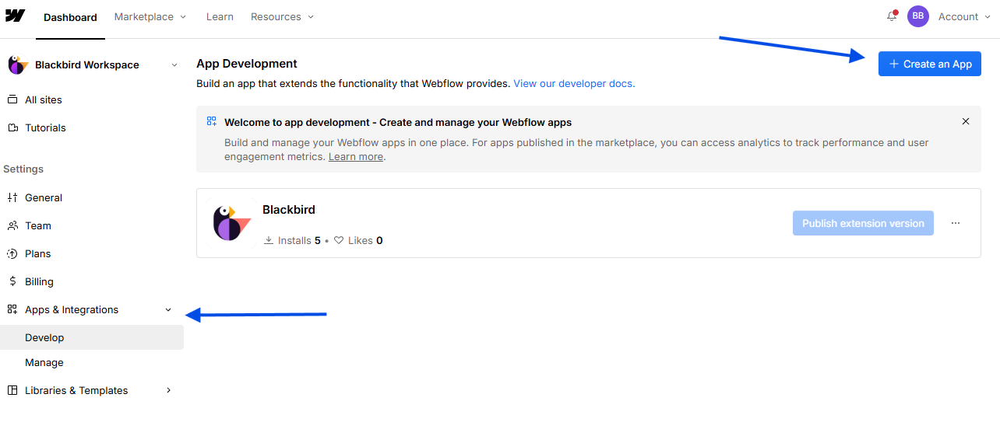
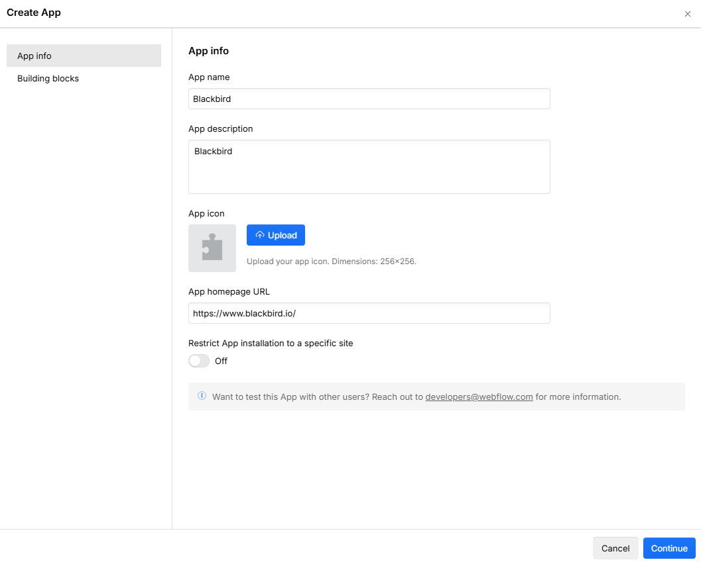
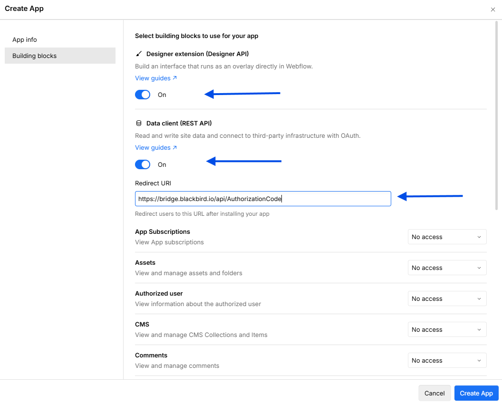
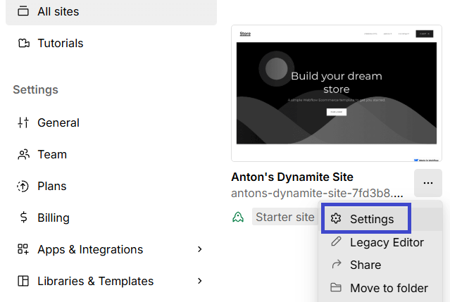

# Blackbird.io Webflow

Blackbird is the new automation backbone for the language technology industry. Blackbird provides enterprise-scale automation and orchestration with a simple no-code/low-code platform. Blackbird enables ambitious organizations to identify, vet and automate as many processes as possible. Not just localization workflows, but any business and IT process. This repository represents an application that is deployable on Blackbird and usable inside the workflow editor.

## Introduction

<!-- begin docs -->

Webflow is a cloud-based web design and development platform that enables users to create, customize, and manage responsive websites visually. It provides a wide range of features and tools for designers, developers, and businesses to build and maintain professional websites without needing to write code. Webflow allows users to publish websites directly, collaborate in real-time, and utilize a robust CMS to manage content. This makes it a versatile solution for individuals, entrepreneurs, and enterprises looking to establish and grow their online presence.

## Before connecting

This app supports two types of connections: **OAuth2** and **Site Token**. You can choose whichever option works best for you. Note that a Site Token limits requests to the site where the token was generated, while OAuth2 allows you to work with multiple sites simultaneously.

1. Ensure you have an active Webflow account. If not, create one here: [here](https://webflow.com/signup).
2. Confirm that at least one site exists in your Webflow account.

### OAuth2

1. Open **Apps & Integrations** in Webflow and create a new application.

2. Provide the application details (name, description and URL can be customized). In **Building blocks**, enable **Designer extension** and **Data client (REST API)**. 
Configure the OAuth redirect URL with: 'https://bridge.blackbird.io/api/AuthorizationCode'. Then select the required scopes.

3. Click **Create app**. After creation, Webflow will generate a **Client ID** and **Client Secret**. Retain these credentials—they are required to connect Webflow to Blackbird.

### Site token

1. Go to your site settings from the **All sites** page.

2. Go to **Apps & Integrations**, scroll down and click **Generate API token**.
3. Enter a **Token name**, then select the required scopes.
4. Click **Generate token**, then copy it and paste it into Blackbird.

## Connecting

Navigate to Apps, and identify the **Webflow** app. You can use search to find it. Click _Add Connection_.

### OAuth2

1. Name your connection for future reference e.g. 'My organization'.
2. Choose **OAuth2** connection type. Input the **Client ID** and **Client Secret** obtained from Webflow.
3. Click _Authorize connection_.
4. Follow the instructions that Webflow gives you.
5. When you return to Blackbird, confirm that the connection has appeared and the status is _Connected_.

### Site token

1. Name your connection for future reference e.g. 'My organization'.
2. Choose **Site token** connection type. Input the **API token** obtained from Webflow.
3. Click _Authorize connection_.
4. Follow the instructions that Webflow gives you.
5. When you return to Blackbird, confirm that the connection has appeared and the status is _Connected_.

## Actions

### Collections

- **Get collection** gets details of a specific collection.
- **Create collection** creates a new collection.
- **Delete collection** deletes a specific collection.

### Collection items

- **Download collection item** returns content of a specific collection item in HTML format.
- **Publish collection item** publishes a specific collection item. This actions can only publish an item of the default locale, because of the Webflow API limitation.
- **Upload collection item** updates content of a specific collection item from HTML file.

### Pages

- **Search pages** searches pages using filters.
- **Download page** gets the page content in HTML file.
- **Upload page** updates page content using HTML file.

### Components

- **Search components** searches all components for a site.
- **Download component** gets the component content in HTML file.
- **Upload component** updates component content using HTML file.

### Sites

- **Search sites** searches sites based on search criteria.
- **Get site** gets details of a site.
- **Publish site** publishes a site to one or more more domains.

### Content

- **Search content** searches for any type of content.
- **Download content** downloads content as HTML for a specific content type based on its ID.
- **Upload content** updates content from an HTML file.
	
## Events

- **On collection item changed** is triggered when a specific collection item is changed.
- **On collection item created** is triggered when a specific collection item is created.
- **On collection item deleted** is triggered when a specific collection item is deleted.
- **On collection item unpublished** is triggered when a specific collection item is unpublished.
- **On page created** is triggered when a specific page is created.
- **On page deleted** is triggered when a specific page is deleted.
- **On page metadata updated** is triggered when specific page metadata is updated.
- **On site published** is triggered when a specific site is published.
- **On page update** is triggered when page update was made.

## Example

## Missing features

Webflow is a huge app with a lot of features. If any of these features are particularly interesting to you, let us know!

## Feedback

Do you want to use this app or do you have feedback on our implementation? Reach out to us using the [established channels](https://www.blackbird.io/) or create an issue.

<!-- end docs -->
